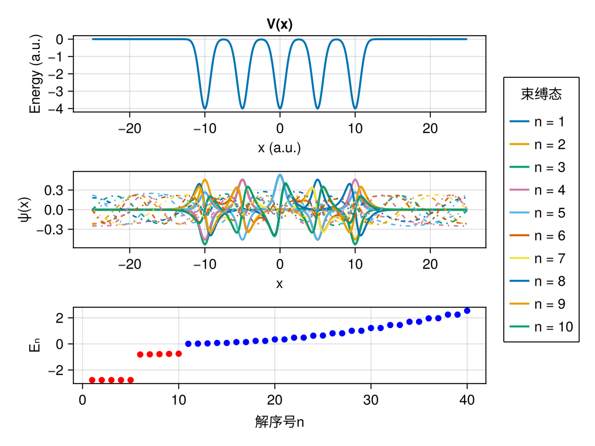

随心所欲，搞一点量子的东西...

01、氢原子电子云  

02、时间演化算子法求解一维Schrödinger方程(Hamilton算子不显含时)  

03、单电子双缝干涉，采用Crank-Nicholson法求解二维Schrödinger方程(Hamilton算子可含时)

04、采用Fourier谱求导矩阵法求解一维定态方程(周期性边界条件)，实线为束缚态，虚线为散射态(Bloch波函数)

